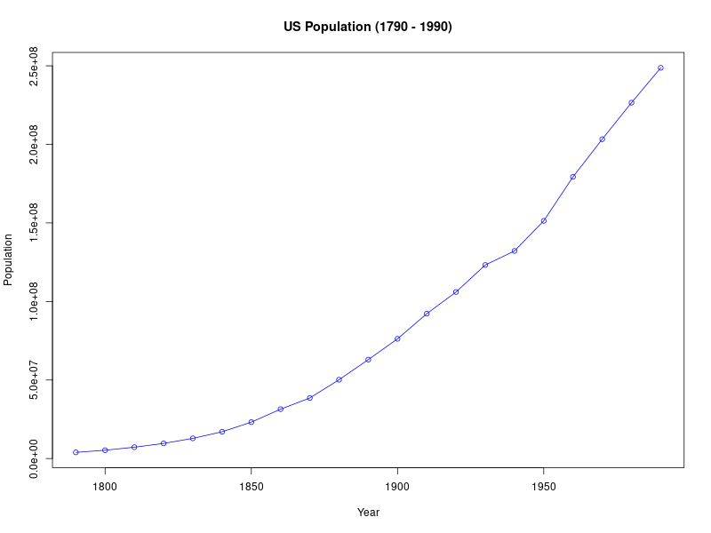

# TSA Practical 1 Report

## Tasks

### (a) & (b) Data Import
The data was entered into a CSV file (`us_population.csv`) and imported into R.

```r
population_df <- read.csv("us_population.csv")
head(population_df)
```

### (c) Time Series Package
While package installation was skipped in this environment, suitable packages for time series analysis in R include `tseries` and `forecast`. The base R `stats` package is sufficient for basic plotting and `ts` object creation.

### (d) Time Series Conversion
The dataset was converted into a time series object using the `ts()` function.

*   **Start Year:** 1790
*   **Sampling:** Every 10 years (Decennial Census)
*   **Frequency:** 0.1 (1 observation per 10 years)

```r
population_ts <- ts(population_df$Population, start = 1790, frequency = 0.1)
```

### (e) Plotting and Analysis

The data was plotted to visualize the change in population over time.



#### Explanation
*   **Dominating Component:** The plot clearly displays a strong **Trend** component. The population shows a consistent monotonic increase from 1790 to 1990. 
*   **Seasonality:** There is no observable seasonality, which is expected given the low sampling frequency (every 10 years).
