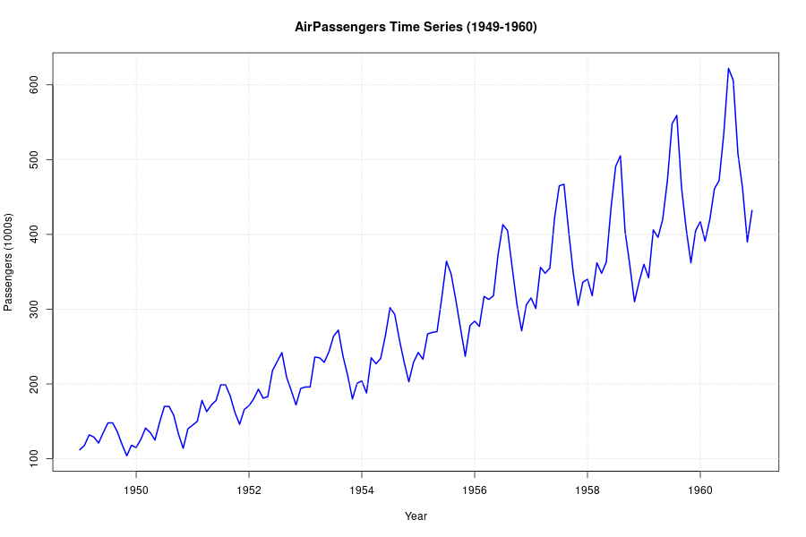
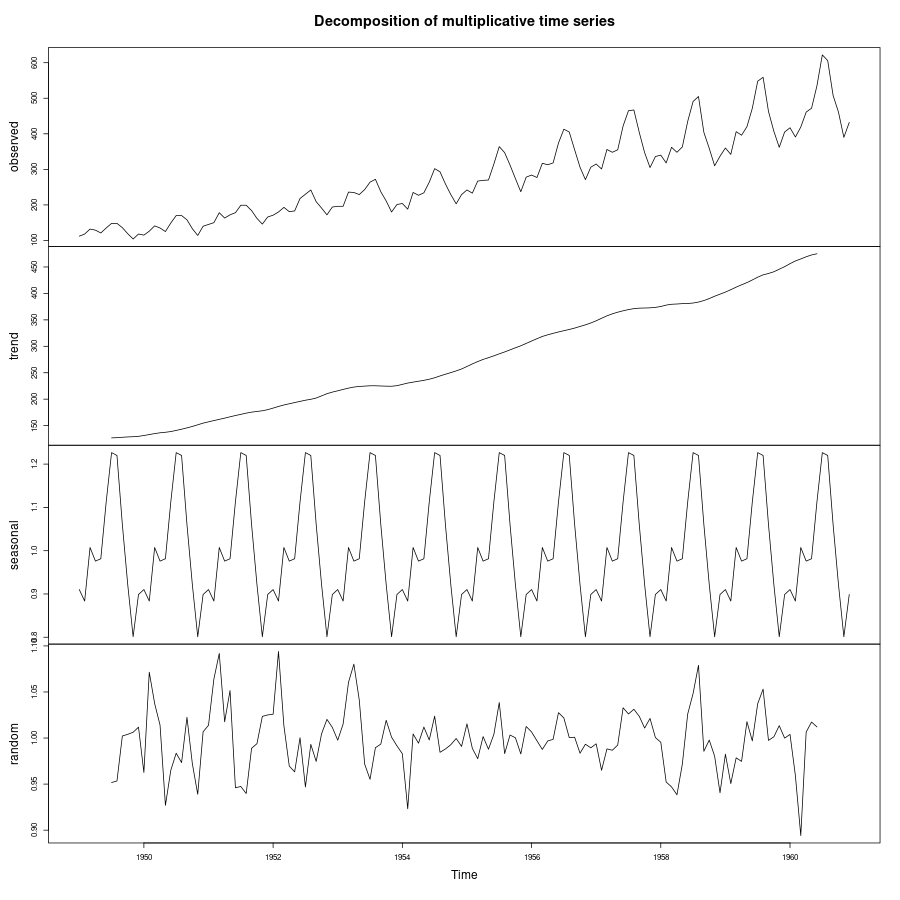
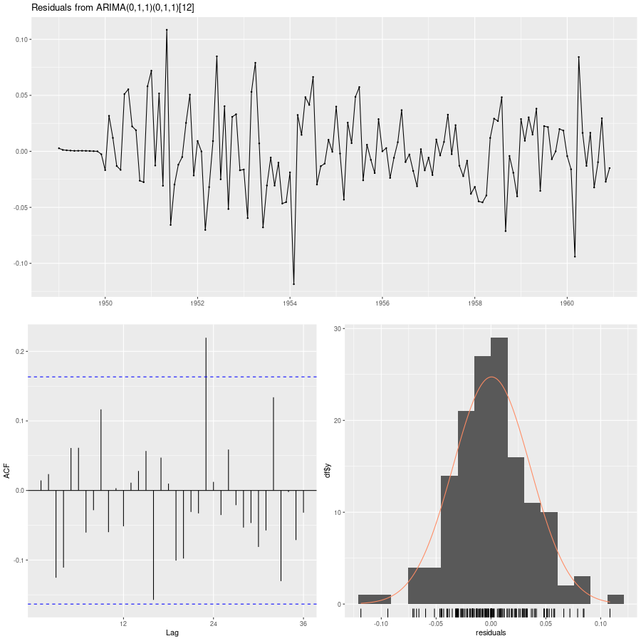
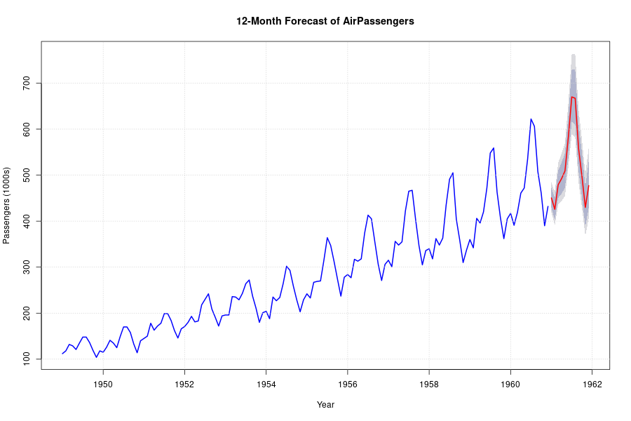

# Practical 10: AirPassengers Time Series Forecasting

## Objective
The objective is to analyze the monthly international airline passengers dataset (`AirPassengers`) and forecast the passenger numbers for the next 12 months (the year 1961).

## Dataset
- **Source**: Standard R dataset `AirPassengers`.
- **Observations**: 144 (Monthly data from 1949 to 1960).
- **Units**: 1,000s of passengers.

## Methodology
1. **Visualization**: Plotted the original series to identify trend and seasonality.
2. **Decomposition**: Applied multiplicative decomposition because the seasonal variation increases as the trend increases.
3. **Stationarity Analysis**: Used KPSS test and ACF/PACF plots.
4. **Model Selection**: Used `auto.arima()` with a log transformation (`lambda=0`) to handle increasing variance.
5. **Validation**: Performed residual diagnostics (Ljung-Box test).
6. **Forecasting**: Projected values for the next 12 months.

## Code Snippet
The analysis followed a structured approach, utilizing the `forecast` and `tseries` libraries:

### 1. Data Preparation
```r
# Loading the built-in R AirPassengers dataset
data(AirPassengers)
ap <- AirPassengers
```

### 2. Exploratory Data Analysis & Decomposition
```r
# Identifying trend and seasonality
plot(ap, main = "AirPassengers Time Series")
# Multiplicative decomposition because variance increases with level
ap_decomp <- decompose(ap, type = "multiplicative")
plot(ap_decomp)
```

### 3. Stationarity Analysis
```r
# Testing for level stationarity
kpss.test(ap, null = "Level")
# ACF/PACF plots for seasonal patterns
acf(ap, lag.max = 48)
pacf(ap, lag.max = 48)
```

### 4. Model selection (with Log Transformation)
```r
# Fit SARIMA with lambda=0 (Log-transformation) to stabilize variance
final_model <- auto.arima(ap, lambda = 0, seasonal = TRUE, stepwise = FALSE, approximation = FALSE)
summary(final_model)
```

### 5. Goodness of Fit (Residual Diagnostics)
Before generating forecasts, we examine the residuals to ensure no patterns remain and the error term is white noise:
```r
# Checkresiduals function calculates Ljung-Box test and plots ACF/Histogram
checkresiduals(final_model)
```

### 6. Forecasting as a Function
Once the model is validated, the forecasting function `forecast()` is applied. Since `lambda=0` was used, it automatically back-transforms the log-scale results back to original units:
```r
# Forecasting the next 12 months (h=12)
ap_forecast <- forecast(final_model, h = 12)
# Plotting the forecast with seasonal behavior maintained
plot(ap_forecast)
```

## Results

### 1. Data Overview
The dataset shows a strong upward trend and clear seasonality.



### 2. Decomposition
The decomposition confirms both an upward trend and a strong seasonal component.



### 3. Model Identification
The KPSS test rejected stationarity ($p < 0.01$). The `auto.arima()` function selected a seasonal ARIMA model:
- **Model**: **SARIMA(0,1,1)(0,1,1)₁₂**
- **AIC**: -483.4
- **BIC**: -474.77

### 4. Goodness of Fit (Residual Diagnostics)
The **Ljung-Box** test gave a p-value of **0.233** (> 0.05), indicating that the residuals are randomly distributed (white noise). This confirms that the model is a good fit and can reliably be used for forecasting.



### 5. Forecast for 1961 (Next 12 Months)
The forecast continues both the growth trend and the seasonal patterns.

| Month | Point Forecast (1000s) | 95% Confidence Interval |
| :--- | :---: | :---: |
| Jan 1961 | **450.4** | [418.9, 484.3] |
| Feb 1961 | **425.7** | [391.2, 463.3] |
| Mar 1961 | **479.0** | [435.6, 526.8] |
| Apr 1961 | **492.4** | [443.5, 546.7] |
| May 1961 | **509.1** | [454.6, 570.0] |
| Jun 1961 | **583.3** | [516.8, 658.5] |
| Jul 1961 | **670.0** | [589.1, 762.1] |
| Aug 1961 | **667.1** | [582.3, 764.2] |
| Sep 1961 | **558.2** | [484.0, 643.8] |
| Oct 1961 | **497.2** | [428.3, 577.2] |
| Nov 1961 | **429.9** | [368.0, 502.1] |
| Dec 1961 | **477.2** | [406.2, 560.7] |



## Conclusion
The forecasting model **SARIMA(0,1,1)(0,1,1)₁₂** predicts that airline passenger numbers will continue to grow through 1961, maintaining the established seasonal peaks (peaking in July/August) and troughs (trough in November).
