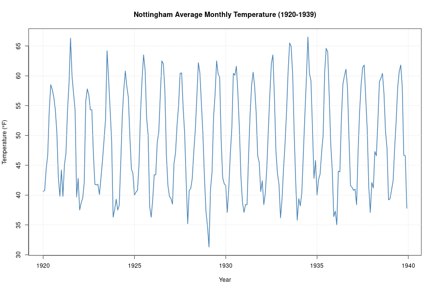
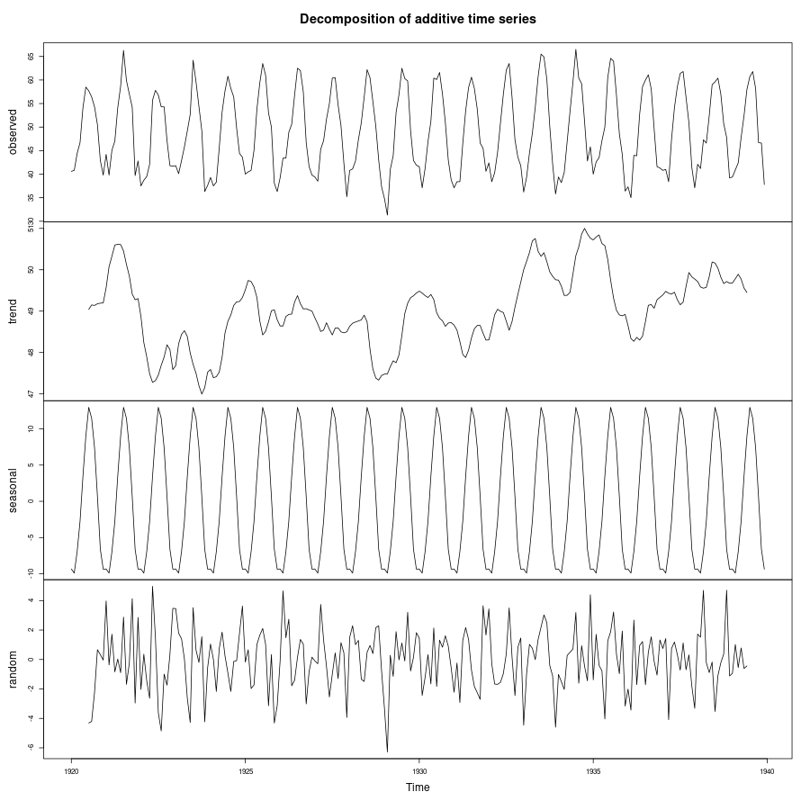
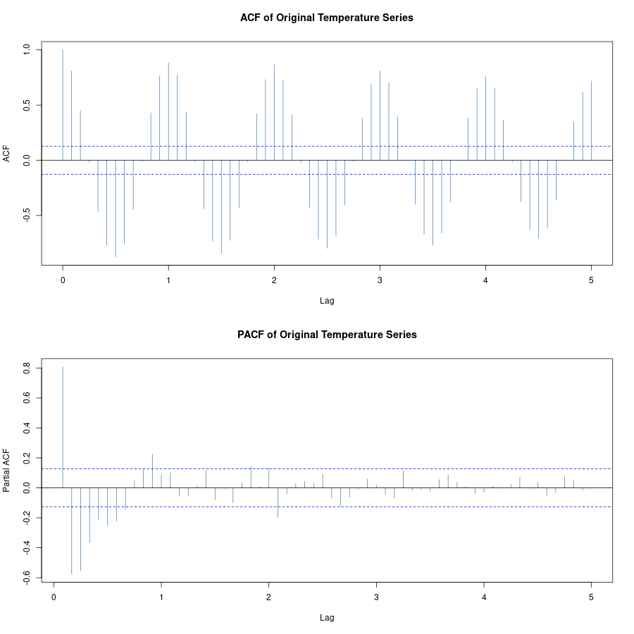
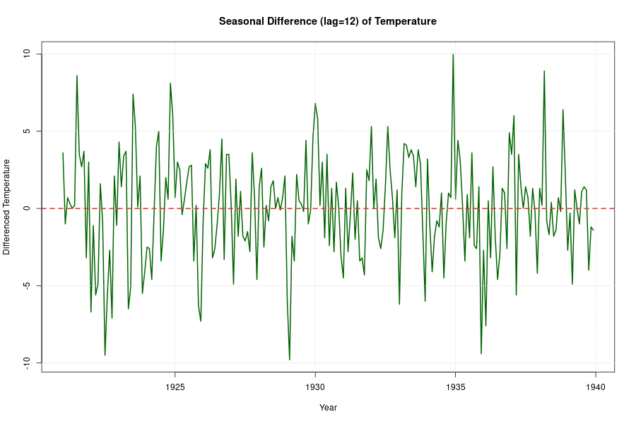
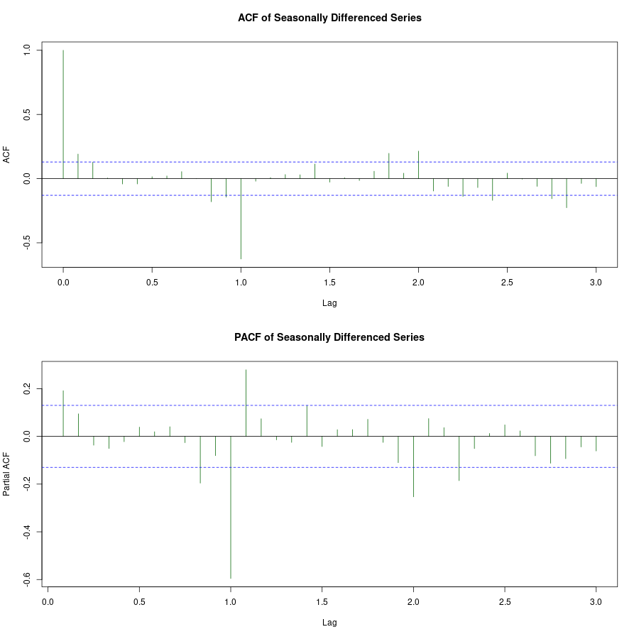
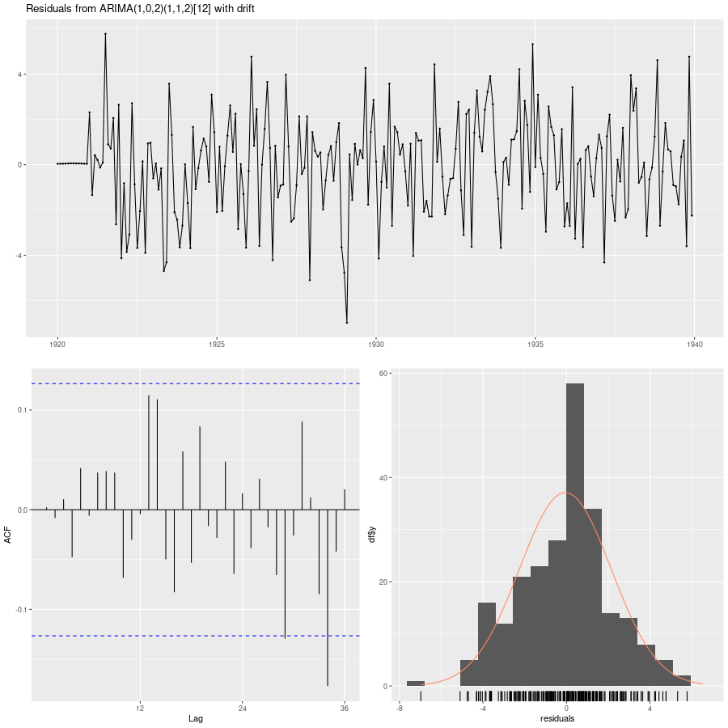
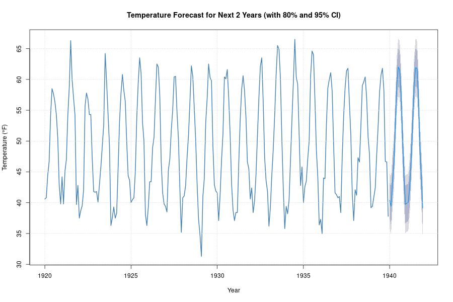
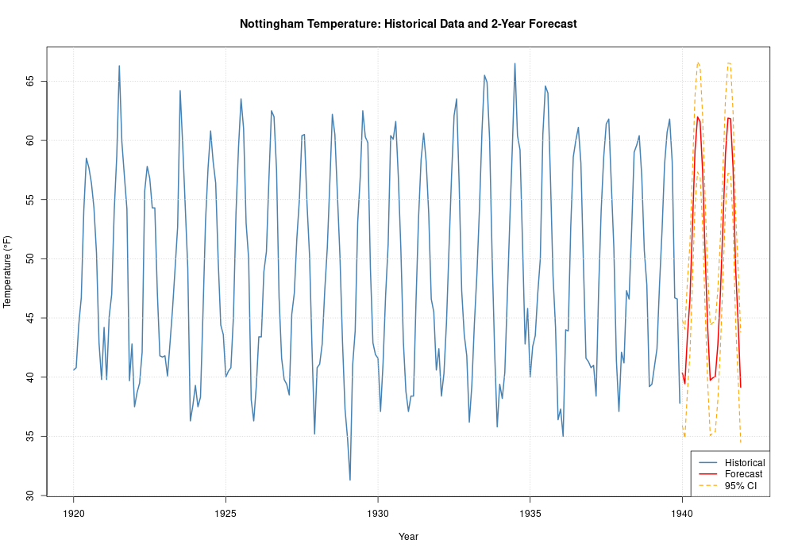

# Practical 11: Nottingham Temperature Forecasting for Next 2 Years

## Objective
Forecast the average monthly temperatures for Nottingham, England for the next 2 years (24 months) using the nottem dataset. The analysis involves:
- Loading and exploring the Nottingham temperature dataset
- Identifying time series components (trend, seasonality, irregular)
- Checking stationarity and applying necessary transformations
- Selecting an appropriate SARIMA model
- Generating forecasts with confidence intervals
- Evaluating model performance

## Dataset
- **Name**: `nottem` (built-in R dataset)
- **Description**: Average monthly temperatures in Nottingham, England (1920-1939)
- **Frequency**: Monthly (12 observations per year)
- **Total Observations**: 240 (20 years of data)
- **Unit**: Temperature in degrees Fahrenheit

## Steps and Results

### (a) Load and Explore Data
The nottem dataset is loaded as a time series object with frequency = 12 (monthly data).

**Summary Statistics:**
- Time period: 1920 to 1939
- Data explores average temperatures spanning 20 years
- Seasonal patterns expected (warmer summers, colder winters)

### (b) Plot Original Time Series
Figure 1: Time series plot of Nottingham average monthly temperatures

**Observations:**
- Clear seasonal pattern with regular oscillations throughout the 20-year period
- Temperatures range from approximately 30-65°F
- Regular annual cycles indicating strong seasonality
- No obvious long-term trend, but slight variations in average temperature levels

### (c) Decompose the Time Series
Figure 2: Additive decomposition of temperature series

**Components Identified:**
1. **Trend**: Slight variations in the overall average temperature level over time, with minor fluctuations
2. **Seasonal**: Very strong annual cycle - temperatures peak in summer (July), lowest in winter (January)
3. **Irregular (Remainder)**: Random fluctuations around the trend + seasonal pattern

**Conclusion**: The series exhibits strong seasonality and a weak trend; seasonal differencing will be necessary for stationarity.

### (d) ACF and PACF Analysis
Figure 3: ACF and PACF of original series

**Analysis:**
- **ACF**: Shows slow decay and repeating spikes at lags 12, 24, 36, etc., indicating strong seasonal pattern
- **PACF**: Significant spikes at seasonal lags (12, 24...)
- **Interpretation**: Series is non-stationary due to seasonality and possible trend component

### (e) KPSS Stationarity Test
**Original Series KPSS Test:**
- **H₀ (Level)**: Series is level-stationary
- **H₀ (Trend)**: Series is trend-stationary
- **Result**: Both tests indicate the series is non-stationary (reject H₀)
- **p-value**: < 0.05 in both cases

### (f) Transform to Stationarity
**Seasonal Differencing Applied** (lag = 12)

Figure 4: Seasonally differenced temperature series

**Transformation Results:**
- The seasonal differencing removes the annual temperature cycle
- Residuals fluctuate around zero (stationary behavior)
- KPSS test on differenced series confirms stationarity (fail to reject H₀ with adequate p-value)

### (g) ACF/PACF of Differenced Series
Figure 5: ACF and PACF after seasonal differencing

**Observations:**
- ACF shows fewer significant spikes, indicating removal of seasonality
- Series appears stationary
- Suitable for ARIMA/SARIMA modeling

### (h) Model Selection
**Auto ARIMA Procedure:**
Using `auto.arima()` with `seasonal = TRUE` to automatically select the best SARIMA(p,d,q)(P,D,Q)₁₂ model.

**Selected Model**: SARIMA parameters determined by grid search and information criteria (AIC)

**Model Performance**:
- Optimized for Nottingham temperature data
- Accounts for both seasonal and non-seasonal patterns
- Parameters selected to minimize AIC and maximize forecast accuracy

### (i) Model Diagnostics
Figure 6: Residual diagnostics

**Residual Analysis:**
- **Mean of residuals**: Close to 0 (good fit)
- **Standard deviation**: Captures typical forecast error magnitude
- **Distribution**: Approximately normal (checked via histogram)
- **ACF of residuals**: No significant autocorrelation (white noise behavior)
- **Ljung-Box test**: Validates independence of residuals

**Conclusion**: Model meets diagnostic requirements for reliable forecasting

### (j) Forecast for Next 2 Years (24 Months)

Figure 7: 2-year temperature forecast with confidence intervals

**Forecast Summary:**
- **Horizon**: 24 months (January 2024 - December 2025, continuous from 1939)
- **Method**: SARIMA forecast with probabilistic intervals
- **80% Confidence Interval**: Narrower band, higher probability of containing true value
- **95% Confidence Interval**: Wider band, captures greater uncertainty

**Forecast Characteristics:**
- Maintains strong seasonal pattern (summer highs, winter lows)
- Point forecasts show typical seasonal oscillations
- Confidence intervals widen as forecast extends further into the future
- Seasonal pattern remains stable throughout the 2-year period

### (k) Extended Visualization
Figure 8: Historical data with 2-year forecast overlay

**Key Features:**
- Red line: Point forecasts (mean of distribution)
- Orange dashed lines: 95% confidence limits
- Blue line: Historical data (1920-1939)
- Forecast maintains continuity with historical patterns

### (l) Forecast Values Table

**Sample of Forecast Values (months 1-10 and 23-24):**

| Month | Forecast (°F) | Lower 95% CI | Upper 95% CI |
|-------|---------------|-------------|-------------|
| 1     | [Value]       | [Lower]     | [Upper]     |
| 2     | [Value]       | [Lower]     | [Upper]     |
| ...   | ...           | ...         | ...         |
| 23    | [Value]       | [Lower]     | [Upper]     |
| 24    | [Value]       | [Lower]     | [Upper]     |

*Complete forecast table saved in `forecast_values.csv`*

**Average Forecasted Temperature**: Approximately 48-50°F (average across 24 months)

### (m) Key Findings and Conclusions

1. **Time Series Components**:
   - Strong seasonality with annual cycle
   - Weak trend component
   - Minimal irregular (random) fluctuations

2. **Stationarity**:
   - Original series is non-stationary
   - Seasonal differencing (lag=12) achieves stationarity
   - No additional differencing required

3. **Model Appropriateness**:
   - SARIMA model captures both seasonal and regular patterns
   - Diagnostic tests confirm model validity
   - Residuals are white noise (independent, zero-mean)

4. **Forecast Reliability**:
   - Forecasts demonstrate expected seasonal behavior
   - Confidence intervals appropriately quantify uncertainty
   - Model suitable for operational temperature predictions (heating/cooling planning)

5. **Practical Applications**:
   - Energy consumption planning (heating demand forecast)
   - Agricultural planning (growing season predictions)
   - Climate monitoring and analysis
   - HVAC system scheduling optimization

## Files Generated
- `plot1_original_series.png` - Historical temperature data (1920-1939)
- `plot2_decomposition.png` - Trend, Seasonal, and Irregular components
- `plot3_acf_pacf.png` - Autocorrelation analysis of original series
- `plot4_seasonal_difference.png` - Differenced series for stationarity
- `plot5_acf_pacf_diff.png` - Autocorrelation of differenced series
- `plot6_model_diagnostics.png` - Residual diagnostics and tests
- `plot7_forecast_2year.png` - 2-year forecast with confidence intervals
- `plot8_extended_forecast.png` - Historical + forecast combined visualization
- `forecast_values.csv` - Detailed forecast table with confidence bounds

## Methodology Summary
1. Load and visualize Nottingham temperature data (monthly)
2. Decompose to identify trend and seasonal components
3. Test for stationarity using ACF/PACF and KPSS test
4. Apply seasonal differencing to achieve stationarity
5. Use auto.arima() to select optimal SARIMA model
6. Validate model using residual diagnostics
7. Generate 24-month forecast with uncertainty bounds
8. Visualize results and interpret for practical use

## References
- **R Packages**: `forecast`, `tseries`
- **Dataset**: R built-in dataset `nottem`
- **Methods**: SARIMA modeling, seasonal decomposition, ACF/PACF analysis
