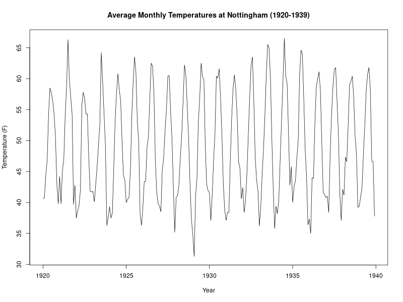

# TSA Practical 2 Report

## Tasks

### (a) Dataset Library
The `nottem` dataset is part of the standard R **`datasets`** package.

```r
library(datasets)
```

### (b) Loading the Dataset
We load the data into the environment using:

```r
data(nottem)
```

### (c) Description and Characteristics
The `nottem` dataset contains **Average Monthly Temperatures at Nottingham, 1920–1939**.
It is a time series object of length 240.

*   **Unit:** Degrees Fahrenheit.
*   **Range:** 1920 to 1939.
*   **Summary Characteristics:**
    *   Min: 31.30
    *   Mean: 49.04
    *   Max: 66.50

### (d) Sampling Frequency
The sampling frequency is **12**, which corresponds to **Monthly** data. This means there are 12 observations per unit of time (1 year).

### (e) Plot and Observations



#### Observations
*   **Pattern:** The plot exhibits a very strong, consistent **Seasonal** pattern.
*   **Seasonality:** The temperature rises and peaks in the middle of each year (Summer) and drops to a trough at the beginning/end of each year (Winter). This cycle repeats annually.
*   **Trend:** There is **no apparent long-term trend** (stationary in the mean); the average temperatures appear roughly constant across the 20-year period.
