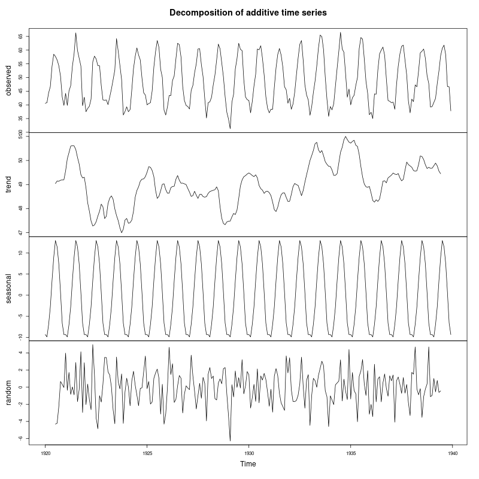

# TSA Practical 3 

## Practical Questions
**Consider the following datasets from the R library and write R code to decompose the time-series data into its trend, seasonal, and residual components. Furthermore, identify the dominating component(s) in the dataset:**
(a) Nottem data
(b) AirPassengers data

## R Code Solution

```r
# Practical-3
rm(list=ls()) # Remove all previous variables

# Consider the following datasets from the R library and write R code to decompose the
# time-series data into its trend, seasonal, and residual components. Furthermore, identify
# the dominating component(s) in the dataset:

# (a) Nottem data
print("--- Analysis for Nottem Data ---")
data(nottem)

# Decompose the time series
# Nottem temperature data is additive (seasonality amplitude doesn't change with trend)
nottem_decomp <- decompose(nottem, type = "additive")

# Plot the decomposition
png("nottem_decomposition.png", width=800, height=800)
plot(nottem_decomp)
dev.off()

# Analyze components
print("Nottem Dominating Component:")
print("The decomposition plot shows a very strong, consistent seasonal pattern.")
print("The trend component is relatively flat (stationary in mean).")
print("Therefore, Seasonality is the dominating component.")


# (b) AirPassengers data
print("--- Analysis for AirPassengers Data ---")
data(AirPassengers)

# Decompose the time series
# AirPassengers data shows increasing variance with the trend, so a Multiplicative model is more appropriate.
# However, for simple decomposition we can show the result. 
# We will use type="multiplicative" which is standard for this dataset.
air_decomp <- decompose(AirPassengers, type = "multiplicative")

# Plot the decomposition
png("airpassengers_decomposition.png", width=800, height=800)
plot(air_decomp)
dev.off()

# Analyze components
print("AirPassengers Dominating Component:")
print("The decomposition plot shows a clear upward Trend.")
print("It also shows strong Seasonality.")
print("Both Trend and Seasonality are dominating components in this dataset.")
```

## Output Plots

### (a) Nottem Decomposition


### (b) AirPassengers Decomposition


## Analysis Summary

### (a) Nottem Data
*   **Decomposition Model:** Additive (Constant variance).
*   **Trend:** The trend line is relatively flat, fluctuating slightly around the mean but showing no significant long-term increase or decrease.
*   **Seasonal:** There is a very distinct and regular seasonal pattern that repeats every year (12-month cycle).
*   **Dominating Component:** **Seasonality** is clearly the dominating component.

### (b) AirPassengers Data
*   **Decomposition Model:** Multiplicative (Increasing variance with level).
*   **Trend:** There is a strong, consistent upward trend over the entire period.
*   **Seasonal:** There is a clear seasonal pattern (peaks in summer months) which repeats annually.
*   **Dominating Component:** Both **Trend** and **Seasonality** are dominating components. The series is driven by strong growth and strong seasonal travel patterns.
