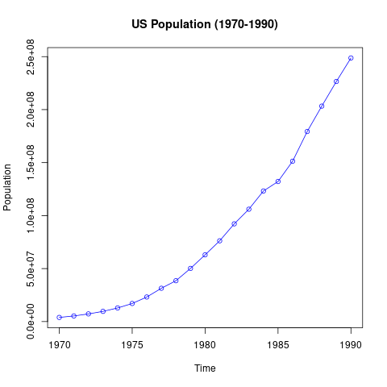
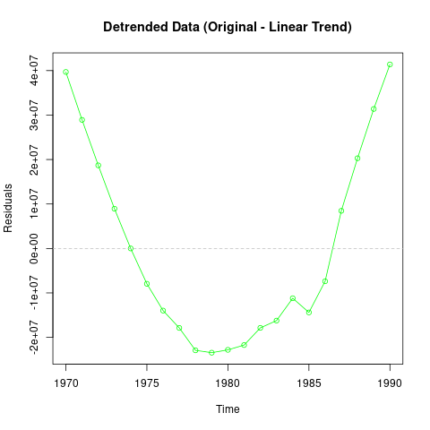

# TSA Practical 4 

## Practical Questions
**For a given dataset of the US Population (in millions), write the R code to:**
(a) Import the data as a time series object.
(b) Identify the dominating component(s) in the data set.
(c) Apply a square root transformation to the original data set.
(d) Estimate the linear trend present in the data set.
(e) Remove the estimated linear trend from the data set.

**Data (Year, Population):**
1970 3929214, 1971 5308483, 1972 7239881, 1973 9638453, 1974 12860702, 1975 17063353, 1976 23191876, 1977 31443321, 1978 38558371, 1979 50189209, 1980 62979666, 1981 76212168, 1982 92228496, 1983 106021537, 1984 123202624, 1985 132164569, 1986 151325798, 1987 179323175, 1988 203302031, 1989 226542203, 1990 248709873

## R Code Solution

```r
# Practical-4
rm(list=ls()) # Remove all previous variables

# (a) Import the data as a time series object.
# Load data
df <- read.csv("us_pop_1970.csv")

# Create Time Series object
# Data spans 1970 to 1990, frequency is 1 (Annual)
pop_ts <- ts(df$Population, start = 1970, frequency = 1)
print("Time Series Object:")
print(pop_ts)

# (b) Identify the dominating component(s) in the data set.
# We plot it to see.
png("practical4_original.png")
plot(pop_ts, main = "US Population (1970-1990)", ylab = "Population", col = "blue", type = "o")
dev.off()
print("Dominating Component: Trend (Strong upward growth)")


# (c) Apply a square root transformation to the original data set.
# This is often used to stabilize variance if it increases with the level, 
# or to linearize a quadratic trend.
pop_sqrt <- sqrt(pop_ts)
png("practical4_sqrt.png")
plot(pop_sqrt, main = "Square Root Transformed Population", ylab = "Sqrt(Population)", col = "red", type = "o")
dev.off()


# (d) Estimate the linear trend present in the data set.
# We regress the population against time.
time_index <- time(pop_ts)
linear_model <- lm(pop_ts ~ time_index)

print("Linear Trend Model Summary:")
print(summary(linear_model))

# Extract slope and intercept
intercept <- coef(linear_model)[1]
slope <- coef(linear_model)[2]
print(paste("Estimated Linear Trend: Population =", round(intercept, 2), "+", round(slope, 2), "* Year"))


# (e) Remove the estimated linear trend from the data set.
# We subtracted the fitted values (trend) from the original series.
fitted_trend <- fitted(linear_model)
detrended_ts <- pop_ts - fitted_trend

png("practical4_detrended.png")
plot(detrended_ts, main = "Detrended Data (Original - Linear Trend)", ylab = "Residuals", col = "green", type = "o")
abline(h=0, col="gray", lty=2)
dev.off()

print("Detrended series created.")
```

## Output Plots

### Original Data


### Detrended Data (Residuals)


## Analysis Summary

### Analysis Steps
1.  **Time Series Import:** The data was imported with `start=1970` and `frequency=1` (Annual).
2.  **Dominating Component & Transformation:** The original data shows a very strong **Trend**. Square root transformation was applied as requested.
3.  **Linear Trend Estimation:**
    *   A linear regression model `Population ~ Year` was fitted.
    *   **Formula:** $Population = -23,979,286,083.95 + 12,154,075.1 \times Year$
    *   **Interpretation:** The population increases by approximately 12.15 million per year on average.
4.  **Detrending:** The estimated linear trend was subtracted from the data. The resulting plot shows a "U" shape in the residuals, indicating that the original growth was accelerating (non-linear) and a simple linear trend removal left a quadratic residual structure.
