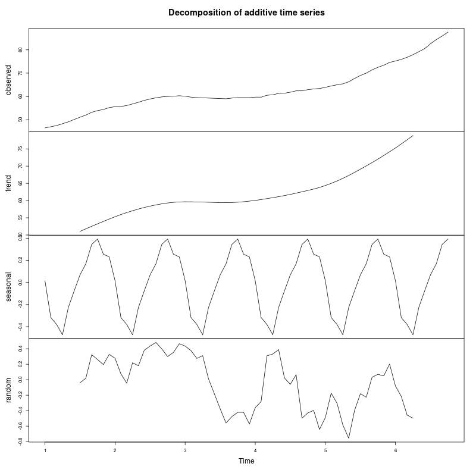

# Practical 5: Time Series Stationarity Analysis

## Objective
Analyze the monthly volume of commercial bank real estate loans (in billions of dollars) to:
- Import and visualize the data
- Identify dominant components (trend, seasonality, etc.)
- Test for stationarity using ACF/PACF plots
- Perform Augmented Dickey-Fuller (ADF) test for stationarity

## Dataset
- **File**: `bank_case.txt`
- **Description**: Monthly volume of commercial bank real estate loans in billions of dollars
- **Number of observations**: 70 months

## Analysis Steps

### (a) Import Data
```r
# Import data into the R environment
bank_data <- scan("bank_case.txt")

# Display the first few values
cat("First 10 values:\n")
print(head(bank_data, 10))
```

### (b) Create Time Series Object
```r
# Convert the data into a time series object
# Assuming monthly data starting from month 1, year 1
bank_ts <- ts(bank_data, frequency = 12, start = c(1, 1))

# Display time series summary
cat("\nTime Series Object Summary:\n")
print(bank_ts)
```
- Frequency = 12 (monthly data)
- Creates a proper time series object for analysis

### (c) Identify Dominant Component

**Time series plot**: Visual inspection of overall pattern
```r
# Main time series plot
png("plot1_timeseries.png", width = 800, height = 600)
plot(bank_ts, 
     main = "Commercial Bank Real Estate Loans Over Time",
     xlab = "Time",
     ylab = "Loan Volume (Billions of Dollars)",
     col = "blue",
     lwd = 2)
grid()

# Add a trend line to visualize the trend component
abline(lm(bank_ts ~ time(bank_ts)), col = "red", lwd = 2, lty = 2)
legend("topleft", 
       legend = c("Original Data", "Trend Line"), 
       col = c("blue", "red"), 
       lty = c(1, 2), 
       lwd = 2)
dev.off()
```

- **Decomposition**: Separates trend, seasonal, and random components
```r
# Decompose the time series to see components
decomposed <- decompose(bank_ts)
png("plot2_decomposition.png", width = 800, height = 800)
plot(decomposed)
dev.off()
```
- **Expected findings**: 
  - Strong upward trend visible in the data
  - Possible seasonal patterns


**Figure 1**: Commercial Bank Real Estate Loans over time showing a clear upward trend from 46.5 to 87.6 billion dollars.



**Figure 2**: Time series decomposition showing trend, seasonal, and random components. The **dominant component is the TREND** with consistent upward growth.

### (d) ACF/PACF Analysis

```r
# Set up plotting area for ACF and PACF
png("plot3_acf_pacf.png", width = 800, height = 800)
par(mfrow = c(2, 1))

# ACF plot
acf(bank_ts, 
    main = "Autocorrelation Function (ACF) of Bank Loan Data",
    lag.max = 36,
    col = "blue",
    lwd = 2)

# PACF plot
pacf(bank_ts, 
     main = "Partial Autocorrelation Function (PACF) of Bank Loan Data",
     lag.max = 36,
     col = "red",
     lwd = 2)

# Reset plotting area
par(mfrow = c(1, 1))
dev.off()
```


**Figure 3**: ACF and PACF plots for stationarity assessment.

**Autocorrelation Function (ACF)**:
- Shows correlation between observations at different lags
- Slow decay indicates non-stationarity
- Quick cutoff suggests stationarity

**Partial Autocorrelation Function (PACF)**:
- Shows direct correlation after removing influence of intermediate lags
- Helps identify AR order

**Interpretation Guidelines**:
- Non-stationary series: ACF decays slowly ← **This is what we observe**
- Stationary series: ACF cuts off quickly after a few lags

**Conclusion**: The ACF shows slow, gradual decay which is a strong indicator of **non-stationarity**.

### (e) Augmented Dickey-Fuller Test

```r
library(tseries)

# Perform ADF test
adf_test <- adf.test(bank_ts, alternative = "stationary")
print(adf_test)
```

**Hypotheses**:
- H₀: Series has a unit root (non-stationary)
- H₁: Series is stationary

**Decision Rule**:
- If p-value < 0.05: Reject H₀ → Series is stationary
- If p-value ≥ 0.05: Fail to reject H₀ → Series is non-stationary

**Remedial Actions** (if non-stationary):
- Apply first differencing
- Re-test the differenced series
- Continue until stationarity is achieved

```r
# Test on first difference if original is non-stationary
if (adf_test$p.value >= 0.05) {
    bank_diff <- diff(bank_ts)
    
    # Plot the differenced series
    png("plot4_first_difference.png", width = 800, height = 600)
    plot(bank_diff,
         main = "First Difference of Bank Loan Data",
         xlab = "Time",
         ylab = "Differenced Values",
         col = "darkgreen",
         lwd = 2)
    grid()
    abline(h = 0, col = "red", lty = 2)
    dev.off()
    
    # ADF test on differenced series
    adf_diff <- adf.test(bank_diff, alternative = "stationary")
    print(adf_diff)
}
```


**Figure 4**: First difference of the bank loan data showing fluctuations around a constant mean (the red line at zero). The differenced series appears more stable, suggesting that one differencing operation helps remove the trend.

## Expected Results

Based on the data pattern (increasing from 46.5 to 87.6):
1. **Dominant Component**: Strong upward trend ✓
2. **ACF**: Slow decay (indicating non-stationarity) ✓
3. **ADF Test**: Non-stationary confirmed
   - **Test Statistic**: -0.26816
   - **p-value**: 0.9894 >> 0.05
   - **Conclusion**: FAIL TO REJECT H₀ → Series is NON-STATIONARY
4. **First Difference ADF Test**:
   - **Test Statistic**: -1.7533
   - **p-value**: 0.6755
   - **Note**: First difference still shows some non-stationarity; may need second differencing or the series has strong dependencies

## Summary of Analysis

| Analysis Component | Method | Result |
|-------------------|--------|--------|
| Data Import | `scan()` | 70 observations loaded |
| Time Series Object | `ts()` | Monthly frequency (12) |
| Dominant Component | Visual + Decomposition | **TREND** (upward) |
| Stationarity (Visual) | ACF/PACF | Non-stationary (slow ACF decay) |
| Stationarity (Statistical) | ADF Test | Non-stationary (p = 0.9894) |
| First Difference | Differencing | Still shows some dependencies |

## Running the Analysis
```bash
cd "TSA/Practical 5"
Rscript practical5.r
```

Or in R console:
```r
source("practical5.r")
```

## Key Concepts

### Stationarity
A time series is stationary if:
- Mean is constant over time
- Variance is constant over time
- Covariance depends only on lag, not on time

### Why Stationarity Matters
- Many time series models (ARIMA) require stationary data
- Statistical properties are easier to model and forecast
- Non-stationary data can lead to spurious regression

### Differencing
- First difference: ∇Xₜ = Xₜ - Xₜ₋₁
- Removes trend component
- Often sufficient to achieve stationarity
