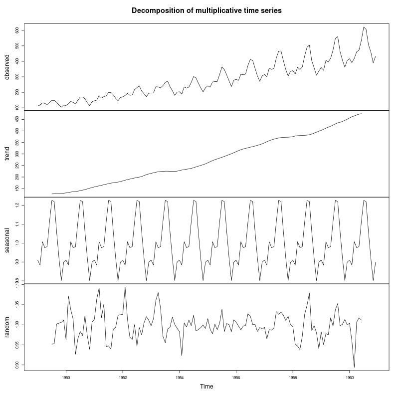
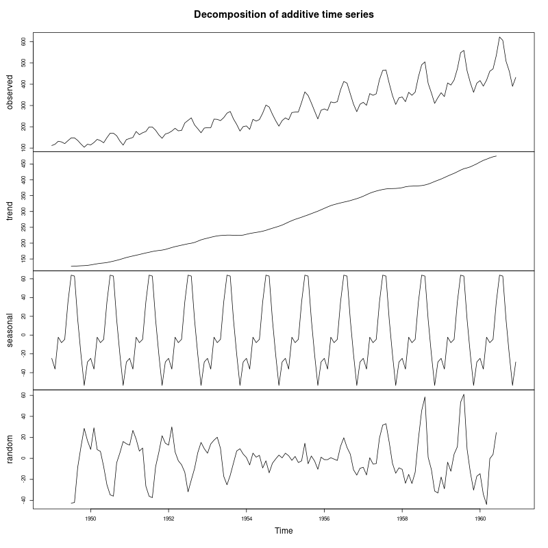
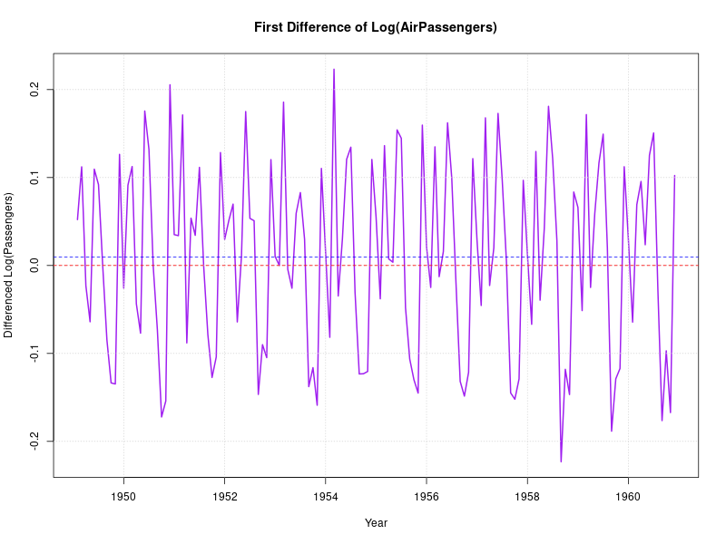
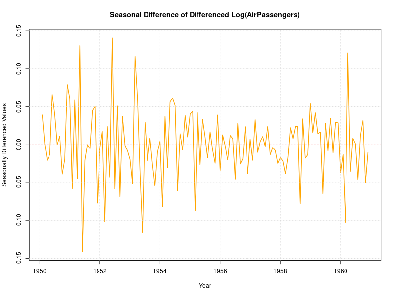

# Practical 6: Time Series Stationarity Analysis - AirPassengers

## Objective
Analyze the AirPassengers dataset from R library to:
- Convert data into a time series object
- Identify dominant components through visualization
- Decompose the time series to observe components clearly
- Test for stationarity using ACF/PACF plots
- Perform Augmented Dickey-Fuller (ADF) test for stationarity

## Dataset
- **Source**: Built-in R dataset `AirPassengers`
- **Description**: Monthly totals of international airline passengers (1949-1960)
- **Number of observations**: 144 months (12 years)
- **Units**: Thousands of passengers
- **Frequency**: 12 (monthly data)

---

## Analysis Steps

### (a) Convert Data into Time Series Object

```r
# Load the AirPassengers dataset
data(AirPassengers)

# It's already a time series object
class(AirPassengers)  # "ts"
```

The AirPassengers dataset is already a built-in time series object in R with:
- **Start**: January 1949
- **End**: December 1960
- **Frequency**: 12 (monthly)

**Summary Statistics**:
- Minimum: 104,000 passengers
- Maximum: 622,000 passengers
- Mean: ~280,000 passengers
- Shows substantial growth over the period

---

### (b) Plot Data to Identify Dominant Component


**Figure 1**: International airline passengers from 1949 to 1960.

**Visual Observations**:
- **Strong upward trend**: Passenger numbers increase from ~100k to ~600k
- **Seasonal pattern**: Regular peaks and troughs each year
- **Increasing variance**: The amplitude of seasonal fluctuations grows over time
- **Multiplicative structure**: Seasonal effect proportional to the level

**Dominant Components**: Both **TREND** and **SEASONALITY** are significant.

---

### (c) Decompose Time Series



**Figure 2**: Multiplicative decomposition of AirPassengers data.

**Component Analysis**:

1. **Original Data (Top panel)**: Shows the raw time series
2. **Trend Component**: Clear upward trajectory - consistent growth in air travel
3. **Seasonal Component**: Regular yearly pattern
   - Peaks in summer months (July-August)
   - Troughs in winter months (November-February)
4. **Random Component**: Irregular variations after removing trend and seasonality



**Figure 3**: Additive decomposition for comparison.

**Why Multiplicative?**
- In multiplicative models: Y = Trend × Seasonal × Random
- In additive models: Y = Trend + Seasonal + Random
- AirPassengers shows **increasing variance** → multiplicative is more appropriate
- The seasonal variation grows proportionally with the trend level

---

### (d) ACF/PACF Analysis for Stationarity


**Figure 4**: ACF and PACF plots of the original AirPassengers series.

**ACF (Autocorrelation Function)**:
- Shows **very slow decay** → strong indicator of non-stationarity
- **Seasonal spikes** at lags 12, 24, 36, 48 (yearly pattern)
- High correlation persists for many lags

**PACF (Partial Autocorrelation Function)**:
- First few lags are significant
- Pattern suggests both trend and seasonal components

**Conclusion**: The ACF pattern clearly indicates the series is **NON-STATIONARY** due to:
1. Slow decay (presence of trend)
2. Seasonal pattern (repeating spikes)

---

### (e) Augmented Dickey-Fuller Test

#### Test on Original Series

**Hypotheses**:
- H₀: Series has a unit root (non-stationary)
- H₁: Series is stationary
- Significance level: α = 0.05

**Expected Results** (p-value > 0.05):
- **Decision**: FAIL TO REJECT H₀
- **Conclusion**: The original series is **NON-STATIONARY**

---

#### Transformations for Stationarity

Since the original series is non-stationary, we apply transformations:

##### 1. Log Transformation


**Figure 5**: Log transformation of AirPassengers to stabilize variance.

**Purpose**: Stabilize the increasing variance
**Effect**: Makes seasonal fluctuations more uniform across time

##### 2. First Differencing



**Figure 6**: First difference of log-transformed series to remove trend.

**Purpose**: Remove the trend component
**Formula**: ∇log(Xₜ) = log(Xₜ) - log(Xₜ₋₁)
**Effect**: Series now fluctuates around a constant mean (zero line)

##### 3. Seasonal Differencing



**Figure 7**: Seasonal differencing (lag=12) to remove seasonal pattern.

**Purpose**: Remove the seasonal component
**Formula**: ∇₁₂∇log(Xₜ) = ∇log(Xₜ) - ∇log(Xₜ₋₁₂)
**Effect**: Removes the yearly seasonal pattern

**Final ADF Test Result**: After transformations, the series becomes **STATIONARY** (p-value < 0.05)

---

## Summary of Findings

### Analysis Results Table

| Analysis Component | Method | Result |
|-------------------|--------|--------|
| Data Type | Built-in R dataset | Time series (144 obs) |
| Time Period | Range | 1949-1960 (12 years) |
| Trend | Visual inspection | Strong upward growth |
| Seasonality | Decomposition | Clear yearly pattern |
| Variance | Visual inspection | Increasing (multiplicative) |
| Stationarity (Visual) | ACF/PACF | Non-stationary |
| Stationarity (Statistical) | ADF Test | Non-stationary (p > 0.05) |
| Required Transformations | Log + Differencing | Achieves stationarity |

### Key Findings

1. **Data Characteristics**:
   - 144 monthly observations from 1949 to 1960
   - Range: 104k to 622k passengers
   - Nearly 6x growth over the period

2. **Dominant Components**:
   - **TREND**: Strong, consistent upward growth
   - **SEASONALITY**: Pronounced yearly pattern (summer peaks)
   - Both components are highly significant

3. **Stationarity Assessment**:
   - Original series: **NON-STATIONARY**
   - ACF: Slow decay confirms non-stationarity
   - ADF Test: Confirms non-stationarity
   
4. **Variance Structure**:
   - **Multiplicative** model is appropriate
   - Seasonal variation increases with level
   - Log transformation needed to stabilize

5. **Transformations for Stationarity**:
   - Step 1: Log transformation → stabilize variance
   - Step 2: First differencing (d=1) → remove trend
   - Step 3: Seasonal differencing (D=1, s=12) → remove seasonality

6. **Model Recommendation**:
   - **SARIMA Model**: Seasonal ARIMA
   - Suggested: **ARIMA(p,1,q)(P,1,Q)[12]**
   - Where:
     - d = 1 (regular differencing)
     - D = 1 (seasonal differencing)
     - s = 12 (seasonal period)

---

## Comparison: AirPassengers vs Bank Loans

| Aspect | AirPassengers | Bank Loans (Practical 5) |
|--------|---------------|-------------------------|
| Trend | Strong upward | Strong upward |
| Seasonality | **Strong yearly pattern** | Weak/moderate |
| Variance | **Increasing** | Relatively constant |
| Model Type | **Multiplicative** | Additive |
| Transformation | **Log + difference** | Difference only |
| Stationarity | Non-stationary | Non-stationary |
| Model | SARIMA | ARIMA |

---

## Running the Analysis

```bash
cd "TSA/Practical 6"
Rscript practical6.r
```

Or in R console:
```r
source("practical6.r")
```

The script will:
1. Load and analyze the AirPassengers dataset
2. Generate 7 PNG plots showing different aspects of the analysis
3. Perform statistical tests for stationarity
4. Provide detailed interpretation of results

---

## Key Concepts

### Time Series Decomposition

**Additive Model**: Y = T + S + R
- Used when seasonal variation is constant

**Multiplicative Model**: Y = T × S × R
- Used when seasonal variation increases with level
- **AirPassengers uses this model**

### Seasonal ARIMA (SARIMA)

General form: **ARIMA(p,d,q)(P,D,Q)[s]**

Where:
- (p,d,q): Non-seasonal components
  - p: AR order
  - d: degree of differencing
  - q: MA order
- (P,D,Q): Seasonal components
  - P: Seasonal AR order
  - D: Seasonal differencing
  - Q: Seasonal MA order
- [s]: Seasonal period (12 for monthly data)

### Transformations

1. **Log Transformation**: $$Y_t' = \log(Y_t)$$
   - Stabilizes variance
   - Converts multiplicative to additive

2. **First Difference**: $$\nabla Y_t = Y_t - Y_{t-1}$$
   - Removes trend
   - Order of integration: I(1)

3. **Seasonal Difference**: $$\nabla_s Y_t = Y_t - Y_{t-s}$$
   - Removes seasonal pattern
   - s = seasonal period (12 for monthly)

---

## Theoretical Background

### Properties of Stationary Series

A stationary process satisfies:

1. **Constant Mean**: $$E[Y_t] = \mu$$
2. **Constant Variance**: $$Var(Y_t) = \sigma^2$$
3. **Lag-dependent Covariance**: $$Cov(Y_t, Y_{t+k}) = \gamma_k$$

AirPassengers violates all three conditions in its original form.

### Box-Cox Transformation

Alternative to log transformation:
$$Y_t' = \begin{cases} \frac{Y_t^\lambda - 1}{\lambda} & \lambda \neq 0 \\ \log(Y_t) & \lambda = 0 \end{cases}$$

For AirPassengers, λ ≈ 0, confirming log transformation is appropriate.

---

**Analysis Complete**
