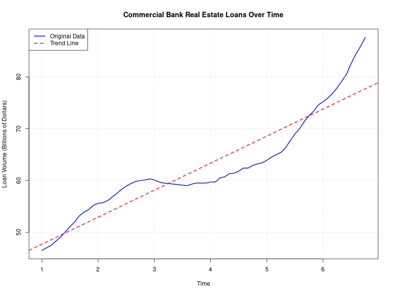
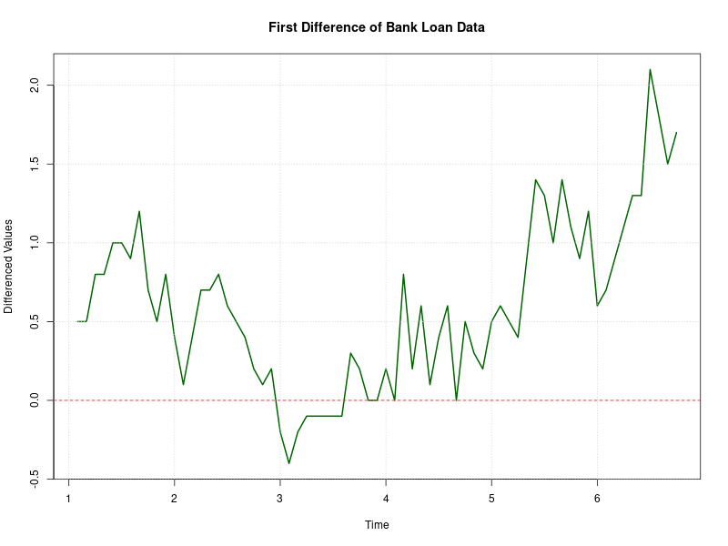

# Practical 7: Time Series Analysis of Commercial Bank Real Estate Loans

## Objective
Analyze the monthly volume of commercial bank real estate loans (in billions of dollars) to:
- Import and visualize the data
- Identify dominant components (trend, seasonality)
- Test for stationarity using ACF/PACF and statistical tests
- Make the series stationary if required
- Select and fit a suitable ARIMA model
- Estimate parameters and check diagnostics

## Dataset
- **File**: `bank_case.txt`
- **Description**: Monthly volume of commercial bank real estate loans (billions of dollars)

## Analysis Steps (code excerpts)

### (a) Import Data
```r
bank_data <- scan("bank_case.txt")
cat("First 10 values:\n")
print(head(bank_data, 10))
cat("Total number of observations:", length(bank_data), "\n")
```

### (b) Create Time Series Object
```r
bank_ts <- ts(bank_data, frequency = 12, start = c(1, 1))
print(summary(bank_ts))
```

### (c) Identify Dominant Component
```r
png("plot1_timeseries.png", width = 800, height = 600)
plot(bank_ts, main = "Commercial Bank Real Estate Loans Over Time", xlab = "Time", ylab = "Loan Volume (Billions)", col = "blue", lwd = 2)
grid()
abline(lm(bank_ts ~ time(bank_ts)), col = "red", lty = 2)
dev.off()

decomposed <- decompose(bank_ts)
png("plot2_decomposition.png", width = 800, height = 800)
plot(decomposed)
dev.off()
```



**Figure 1**: Time series with fitted linear trend — dominant component is the **trend**.


**Figure 2**: Decomposition (trend, seasonal, random).

### (d) ACF/PACF
```r
png("plot3_acf_pacf.png", width = 800, height = 800)
par(mfrow = c(2,1))
acf(bank_ts, lag.max = 36, main = "ACF of Bank Loan Data")
pacf(bank_ts, lag.max = 36, main = "PACF of Bank Loan Data")
par(mfrow = c(1,1))
dev.off()
```


**Figure 3**: ACF shows slow decay → indicates non-stationarity.

### (e) ADF & KPSS tests
Run the tests (requires `tseries`):
```r
library(tseries)
adf_test <- adf.test(bank_ts, alternative = "stationary")
print(adf_test)
kpss_test <- kpss.test(bank_ts, null = "Trend")
print(kpss_test)
```

Current run results (from script):
- ADF p-value = 0.9894 → fail to reject non-stationary
- KPSS p-value = 0.01 → reject trend-stationary

### (f) Differencing
```r
bank_diff <- diff(bank_ts)
png("plot4_first_difference.png", width = 800, height = 600)
plot(bank_diff, main = "First Difference", col = "darkgreen")
abline(h = 0, col = "red", lty = 2)
dev.off()
```



**Figure 4**: First difference — used to remove trend. Re-test stationarity after differencing.

### (g) Model selection & fitting
The script attempts `forecast::auto.arima()` if `forecast` is installed. On this system `forecast` was not installed, and the fallback `arima(..., order=c(1,1,1))` failed with a non-stationary AR error.

To enable full model selection and fitting, install `forecast` and re-run:
```r
install.packages('forecast')
```
then
```bash
Rscript Practical7/practical7.r
```

### (h) Residual diagnostics
If model fitting completes, residual diagnostics will be saved to `plot5_residuals.png`.

## Files generated by current run
- `plot1_timeseries.png`
- `plot2_decomposition.png`
- `plot3_acf_pacf.png`
- `plot4_first_difference.png`
- `plot5_residuals.png` (not generated due to model-fit error)

## Notes
- Install missing packages if required:
  - `install.packages('tseries')`
  - `install.packages('forecast')`
- Run the script to regenerate plots and complete model-fitting:
```bash
Rscript Practical7/practical7.r
```

---

**Reference R Script:** `practical7.r`
**Data File:** `bank_case.txt`
