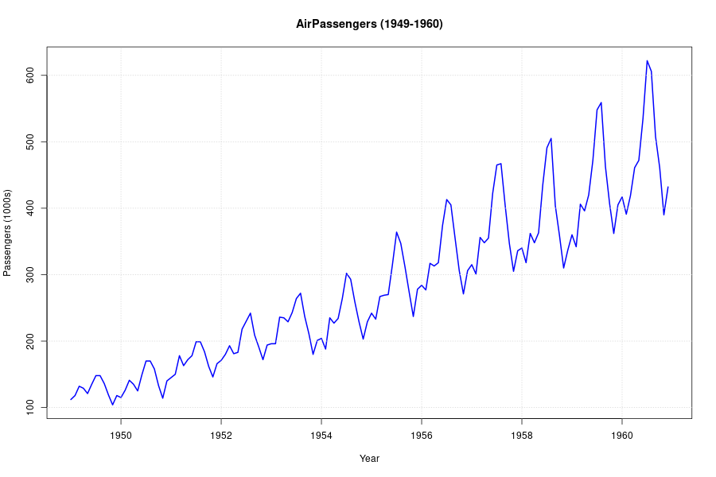
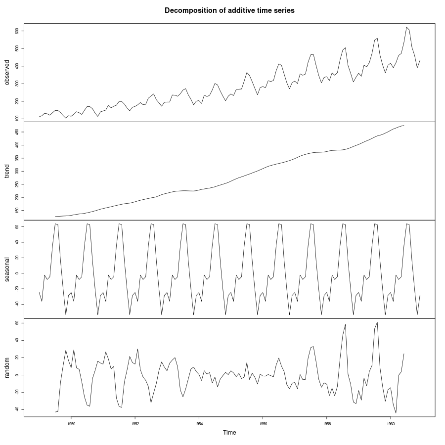
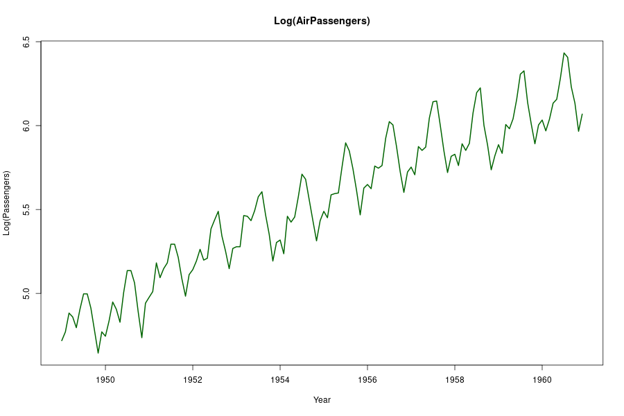
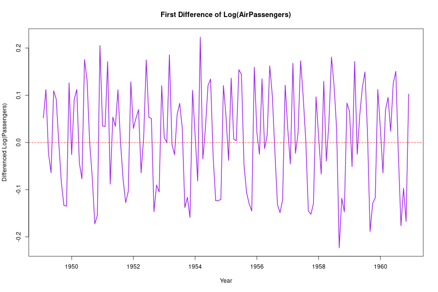
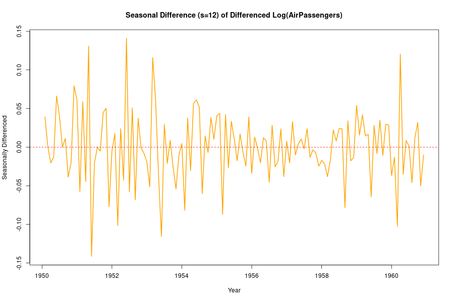
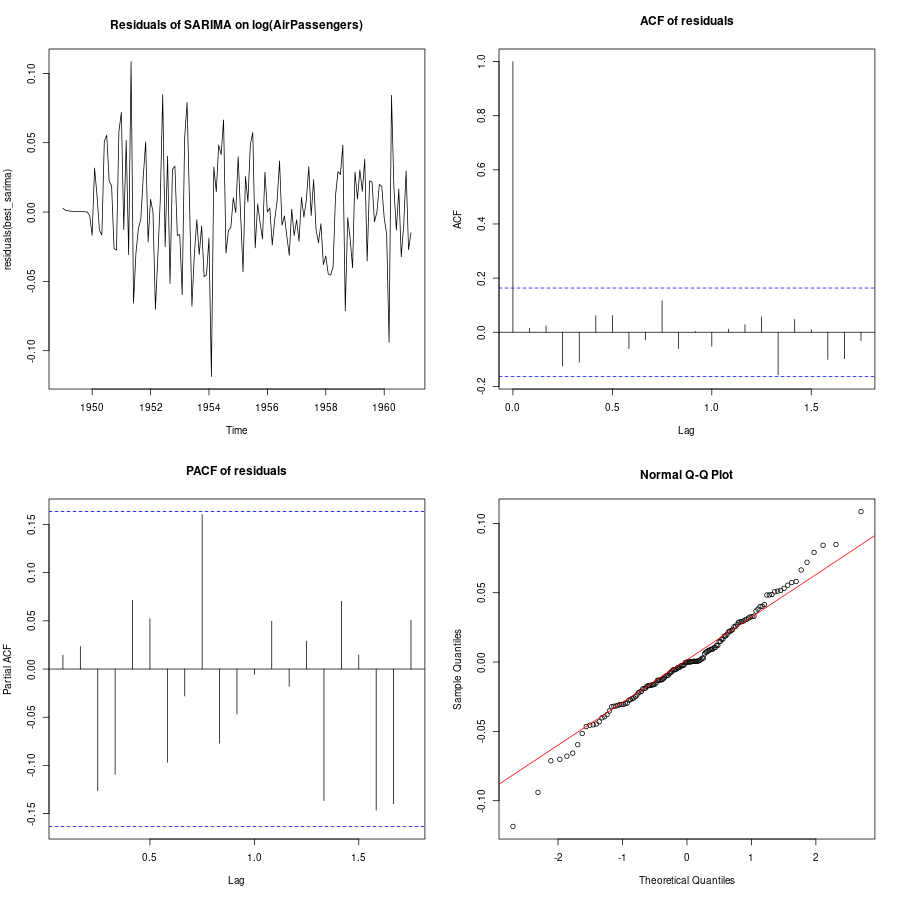

# Practical 8: AirPassengers Time Series Analysis

## Objective
Analyze the `AirPassengers` dataset to:
- Convert to time series (monthly)
- Identify dominant components (trend, seasonality)
- Decompose the series
- Check stationarity (ACF/PACF, KPSS)
- Make the series stationary if required
- Select and fit a suitable model (SARIMA)
- Estimate parameters and check goodness of fit

## Dataset
- Built-in R dataset: `AirPassengers` (monthly international airline passengers, 1949-1960)
- Observations: 144

## Steps and results

### (f) Convert to time series
`AirPassengers` is already a `ts` object. We assign it to `ap` in the script.

### (g) Plot the data
Figure 1: Time series plot of `AirPassengers`.



Observation: strong upward trend and increasing seasonal amplitude.

### (h) Decompose the data
We used multiplicative decomposition (appropriate because variance increases with level).

Figure 2: Multiplicative decomposition


Figure 3: Additive decomposition (for comparison)



Conclusion: Both trend and seasonality are dominant; multiplicative decomposition fits better.

### (i) ACF/PACF
Figure 4: ACF and PACF of original series.


ACF shows slow decay and strong seasonal spikes (lags 12, 24...), indicating non-stationarity with seasonal component.

### (j) KPSS test
KPSS results on original series (from script):
- KPSS (level): p-value ≈ 0.01 → reject stationarity
- KPSS (trend): p-value ≈ 0.10 → less clear for trend-stationarity

Conclusion: series is non-stationary.

### (k) Make stationary
We applied log transform to stabilize variance, then first differencing and seasonal differencing (lag=12).

Figure 5: Log-transformed series



Figure 6: First difference of log series



Figure 7: Seasonal difference of differenced log series (s=12)



KPSS tests on transformed series indicated stationarity after differencing (p-values > 0.05 in the script's output for differenced series).

### (l) Model selection
Dominant components: trend + seasonality → SARIMA is appropriate. We used `forecast::auto.arima` on `log(ap)` with thorough search.

### (m) Fit model and estimate parameters
Selected model (auto.arima): ARIMA(0,1,1)(0,1,1)[12] on `log(ap)`.

Coefficients (from script):
- ma1 = -0.4018 (s.e. 0.0896)
- sma1 = -0.5569 (s.e. 0.0731)

AIC = -483.4

### (n) Goodness of fit
Residual diagnostics saved in Figure 8.



Ljung-Box test on residuals: p-value ≈ 0.6079 → fail to reject null, residuals appear uncorrelated (good fit).

## Files generated
- `plot1_airpassengers.png`
- `plot2_decomposition_multiplicative.png`
- `plot3_decomposition_additive.png`
- `plot4_acf_pacf.png`
- `plot5_log_series.png`
- `plot6_diff1_log.png`
- `plot7_seasonal_diff.png`
- `plot8_residuals_diagnostics.png`
- `best_sarima_airpassengers.rds`

## Notes
- Script: `practical8.r` (located in Practical8 folder)
- Packages used: `tseries`, `forecast` (script installs if missing)
- To replicate: run

```bash
Rscript Practical8/practical8.r
```
