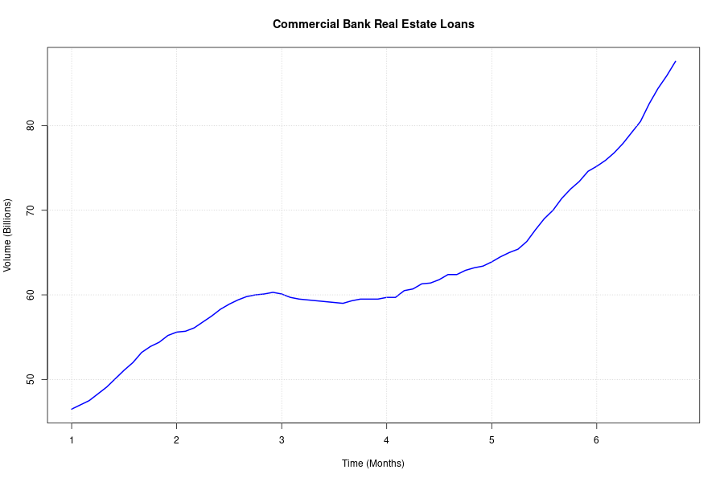
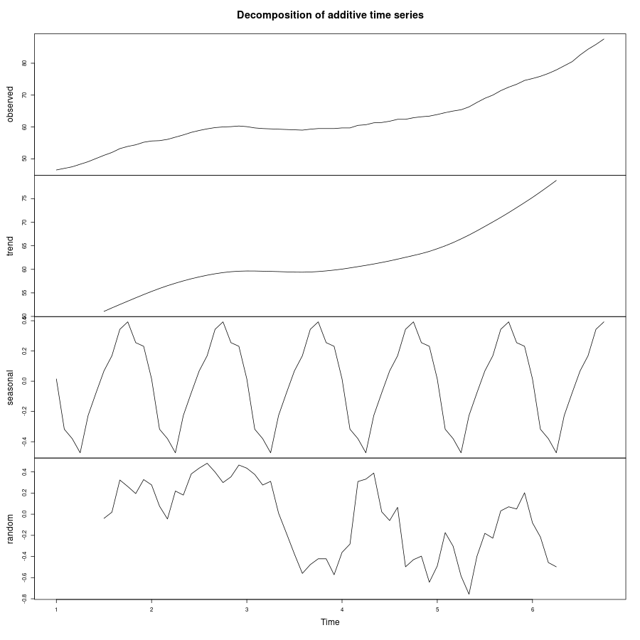
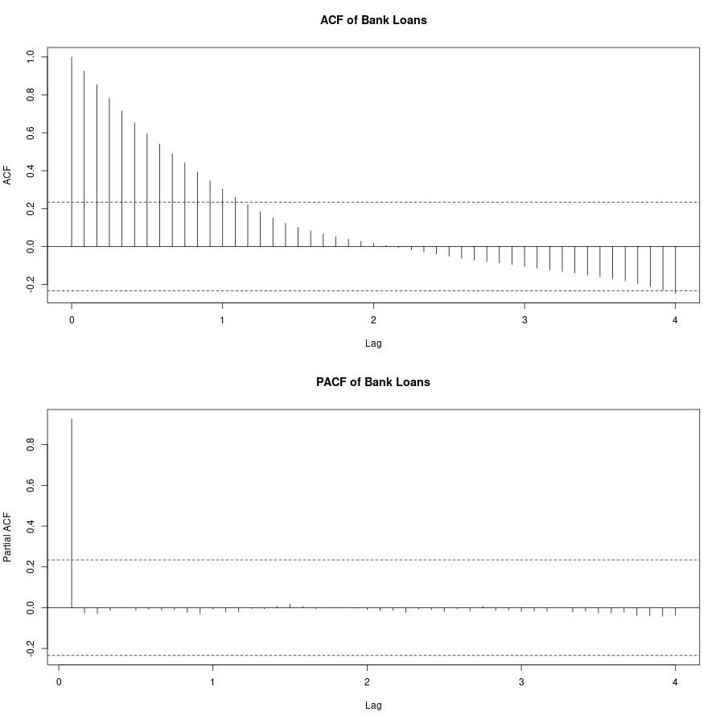
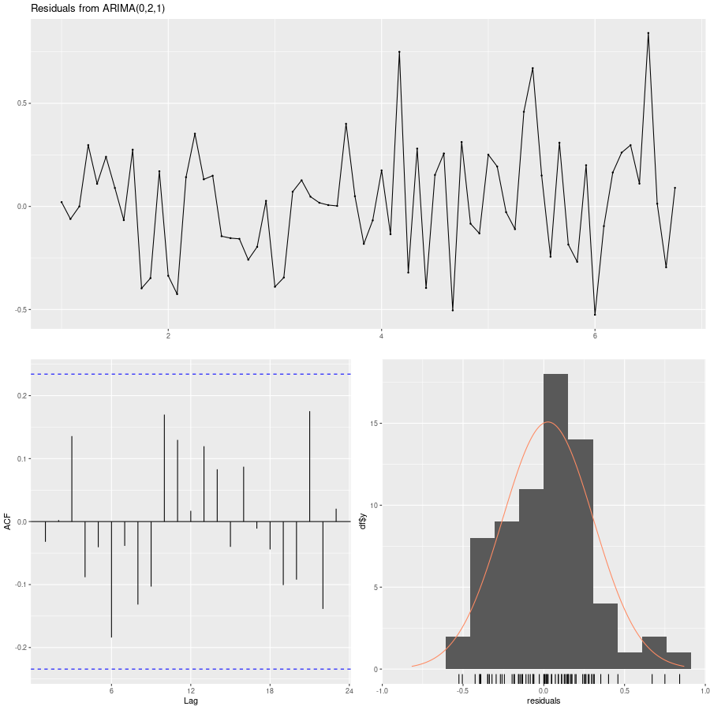
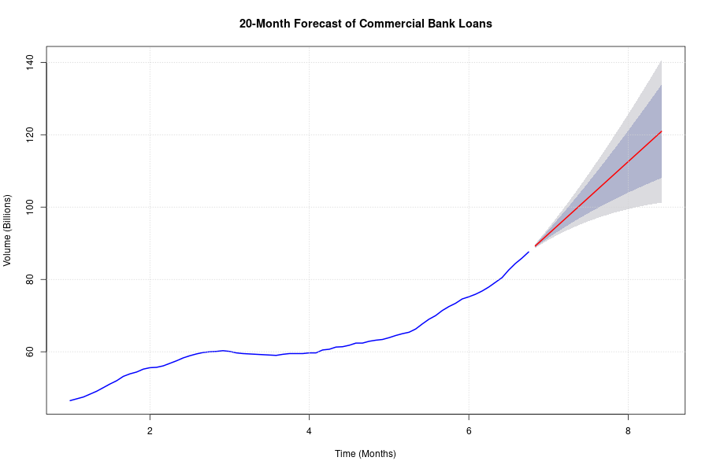

# Practical 9: Commercial Bank Real Estate Loans Forecast

## Objective
The goal of this analysis is to forecast the monthly volume of commercial bank real estate loans for the next 20 months using the `bank_case.txt` dataset.

## Dataset
- **File**: `bank_case.txt`
- **Observations**: 70 monthly records
- **Variable**: Volume of commercial loans (Billions)

## Methodology
1. **Time Series Conversion**: The data was converted into a monthly time series object (`ts`).
2. **Exploratory Data Analysis**: Visualized the trend and seasonality.
3. **Stationarity Testing**: Performed KPSS test and analyzed ACF/PACF plots.
4. **Model Selection**: Used `auto.arima()` to identify the optimal (S)ARIMA model based on AIC/BIC.
5. **Forecasting**: Generated a 20-month forecast with 80% and 95% confidence intervals.
6. **Diagnostics**: Checked residuals for white noise properties using the Ljung-Box test.

## Code Snippet
The analysis followed a structured approach, utilizing the `forecast` and `tseries` libraries:

### 1. Data Preparation & Time Series Object
```r
# Loading the commercial loan volume from a text file
bank_data <- read.table("../Practical7/bank_case.txt", header = FALSE)
# Converting to a monthly time series (frequency=12)
bank_ts <- ts(bank_data$V1, frequency = 12, start = c(1, 1))
```

### 2. Exploratory Data Analysis & Decomposition
```r
# Plotting the original series to identify components
plot(bank_ts, main = "Commercial Bank Real Estate Loans")
# Additive decomposition to observe the strong trend
bank_decomp <- decompose(bank_ts, type = "additive")
plot(bank_decomp)
```

### 3. Stationarity Testing
```r
# KPSS test for level stationarity
kpss.test(bank_ts, null = "Level")
# ACF/PACF analysis
acf(bank_ts, lag.max = 48)
pacf(bank_ts, lag.max = 48)
```

### 4. Optimal Model Selection (auto.arima)
```r
# Use auto.arima to find the best (S)ARIMA parameters based on minimized AIC/BIC
best_model <- auto.arima(bank_ts, seasonal = TRUE, stepwise = FALSE, approximation = FALSE)
summary(best_model)
```

### 5. Residual Diagnostics & Goodness of Fit
Before forecasting, we must ensure the model is statistically sound by checking if the residuals behave like white noise:
```r
# Checkresiduals function performs Ljung-Box test and plots residual distribution
checkresiduals(best_model)
```

### 6. Forecasting as a Function
Once the model's goodness of fit is confirmed, the primary forecasting function is `forecast()`, which takes the fitted model object and the horizon `h` (number of periods) as arguments:
```r
# Forecasting the next 20 months (h=20)
bank_forecast <- forecast(best_model, h = 20)
# Visualizing the forecast including confidence intervals
plot(bank_forecast)
```

## Analysis and Results

### 1. Data Visualization
The original series shows a clear non-linear upward trend, especially in the latter half of the dataset.



### 2. Decomposition
The decomposition shows a strong trend component.



### 3. Stationarity and ACF/PACF
- **KPSS Test**: Level stationarity was rejected ($p < 0.01$), indicating the series is non-stationary.
- **ACF**: Showed very slow decay, confirming a trend.



### 4. Model Selection
The `auto.arima` function selected an **ARIMA(0,2,1)** model. 
- **Model**: Second-order differencing ($d=2$) with a first-order moving average ($MA(1)$).
- **AIC**: 26.13
- **BIC**: 30.57

### 5. Residual Diagnostics (Goodness of Fit)
The Ljung-Box test resulted in a p-value of **0.4446**, which is greater than 0.05. This indicates that the residuals are indistinguishable from white noise, meaning the model has captured the underlying pattern well and is suitable for forecasting.



### 6. Forecast (Next 20 Months)
The forecast predicts a continued upward linear trend for the next 20 months.

| Period | Month-Year | Point Forecast | 95% Lower Bound | 95% Upper Bound |
| :--- | :--- | :---: | :---: | :---: |
| +1 Month | Nov 6 | **89.27** | 88.70 | 89.83 |
| +6 Months | Apr 7 | **97.60** | 93.77 | 101.43 |
| +12 Months | Oct 7 | **107.60** | 97.96 | 117.23 |
| +18 Months | Apr 8 | **117.60** | 100.62 | 134.58 |
| +20 Months | Jun 8 | **120.93** | 101.21 | 140.65 |



## Projections and Key Insights
- **Trend Persistent**: The ARIMA(0,2,1) model with $d=2$ implies that the series is non-stationary and the trend is very persistent, leading to a strong linear projection.
- **Widening Uncertainty**: The confidence intervals widen significantly over time (from $\pm 0.5$ in month 1 to $\pm 20$ in month 20), indicating that while the trend is upward, the long-term volume is subject to increased market volatility.
- **Model Validity**: The residual diagnostics confirm the model is statistically sound for this dataset.

## Conclusion
The volume of commercial bank real estate loans is expected to continue its growth. The ARIMA(0,2,1) model provides a statistically sound fit for the data, as evidenced by the residual diagnostics.
