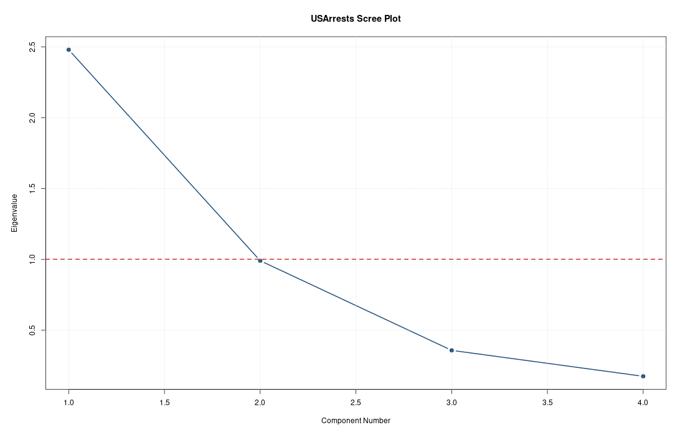
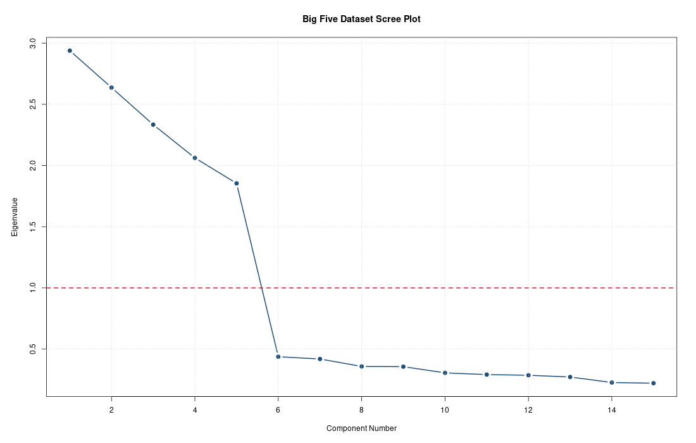
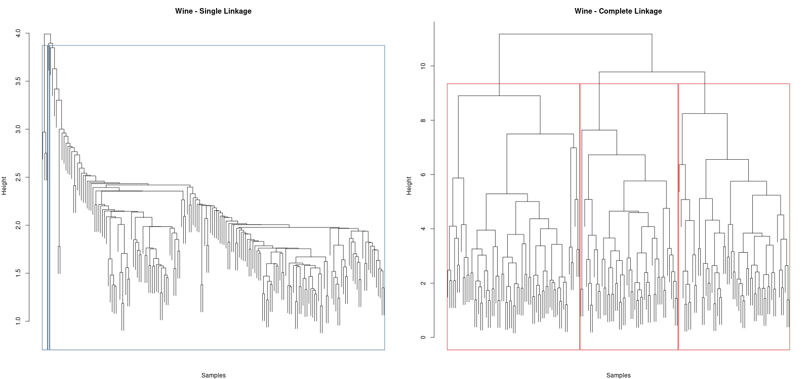
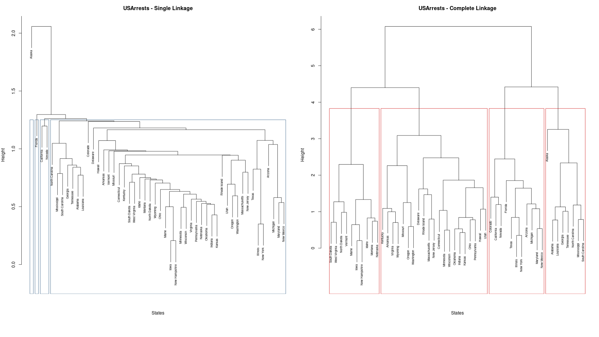

# Practice Questions Report: Factor Analysis and Hierarchical Clustering

This report solves the four practice tasks and includes required plots.

## 1) Factor Analysis on USArrests

### Plot


### Code Snippet
```r
library(psych)

usarrests_scaled <- scale(USArrests)
usarrests_eigs <- eigen(cor(usarrests_scaled))$values

plot(usarrests_eigs, type = "b", pch = 19,
	xlab = "Component Number", ylab = "Eigenvalue",
	main = "USArrests Scree Plot")
abline(h = 1, col = "red", lty = 2)

fa_us <- fa(usarrests_scaled, nfactors = 2, rotate = "varimax", fm = "ml")
print(fa_us$loadings, cutoff = 0.30)
```

### How it works (short)
Factor analysis models observed variables using a smaller number of latent factors. We standardized variables, used a correlation matrix, and extracted 2 factors with varimax rotation.
Proportion variance explained (F1, F2): 0.489, 0.214

Top loading variables:
- ML1: Murder, Assault
- ML2: UrbanPop, Rape

Saved loadings table: `plots/usarrests_loadings.csv`

## 2) Factor Analysis on big_five_personality_teaching_dataset

### Plot


### Code Snippet
```r
library(readxl)
library(psych)

bigfive <- read_excel("big_five_personality_teaching_dataset.xlsx")
bigfive_num <- as.data.frame(bigfive)[, sapply(bigfive, is.numeric), drop = FALSE]
bigfive_num <- na.omit(bigfive_num)
bigfive_scaled <- scale(bigfive_num)

bigfive_eigs <- eigen(cor(bigfive_scaled))$values
plot(bigfive_eigs, type = "b", pch = 19,
	xlab = "Component Number", ylab = "Eigenvalue",
	main = "Big Five Scree Plot")
abline(h = 1, col = "red", lty = 2)

fa_big <- fa(bigfive_scaled, nfactors = 5, rotate = "varimax", fm = "ml")
print(fa_big$loadings, cutoff = 0.30)
```

### How it works (short)
The Big Five items were reduced into 5 latent factors (Extraversion, Agreeableness, Conscientiousness, Neuroticism, Openness style structure) using ML factor analysis with varimax rotation.
Proportion variance explained (F1..F5): 0.141, 0.138, 0.138, 0.134, 0.132

Top loading variables:
- ML1: A2_Cooperative, A3_Forgiving
- ML2: C1_Organized, C2_Disciplined
- ML3: N2_Worry, N3_Moody
- ML4: O2_Imaginative, O1_Creative
- ML5: E3_Energetic, E2_Sociable

Saved loadings table: `plots/bigfive_loadings.csv`

## 3) Hierarchical Clustering on Wine Dataset (Single vs Complete)

### Plot


### Code Snippet
```r
# wine_features: numeric wine measurements (class column removed)
wine_scaled <- scale(wine_features)
wine_dist <- dist(wine_scaled)

wine_hc_single <- hclust(wine_dist, method = "single")
wine_hc_complete <- hclust(wine_dist, method = "complete")

par(mfrow = c(1, 2))
plot(wine_hc_single, labels = FALSE, main = "Wine - Single Linkage")
rect.hclust(wine_hc_single, k = 3, border = "blue")
plot(wine_hc_complete, labels = FALSE, main = "Wine - Complete Linkage")
rect.hclust(wine_hc_complete, k = 3, border = "red")
```

### How it works (short)
Hierarchical clustering starts with each sample as its own cluster and merges clusters step-by-step using distance rules. Single linkage uses nearest points (can chain clusters), while complete linkage uses farthest points (more compact clusters).

## 4) Cluster US States by Crime Rates (USArrests)

### Plot


### Code Snippet
```r
usarrests_scaled <- scale(USArrests)
us_dist <- dist(usarrests_scaled)

us_hc_single <- hclust(us_dist, method = "single")
us_hc_complete <- hclust(us_dist, method = "complete")

par(mfrow = c(1, 2))
plot(us_hc_single, cex = 0.65, main = "USArrests - Single Linkage")
rect.hclust(us_hc_single, k = 4, border = "blue")
plot(us_hc_complete, cex = 0.65, main = "USArrests - Complete Linkage")
rect.hclust(us_hc_complete, k = 4, border = "red")

us_clusters <- data.frame(
	State = rownames(USArrests),
	Single_Linkage_Cluster = cutree(us_hc_single, k = 4),
	Complete_Linkage_Cluster = cutree(us_hc_complete, k = 4)
)
head(us_clusters)
```

### How it works (short)
After standardizing crime variables, hierarchical clustering groups states with similar crime profiles. Single linkage may connect clusters early; complete linkage usually gives tighter and more separated groups.

Saved cluster membership table: `plots/usarrests_clusters.csv`

---
To rerun everything: `Rscript solve_practice_questions.R`
